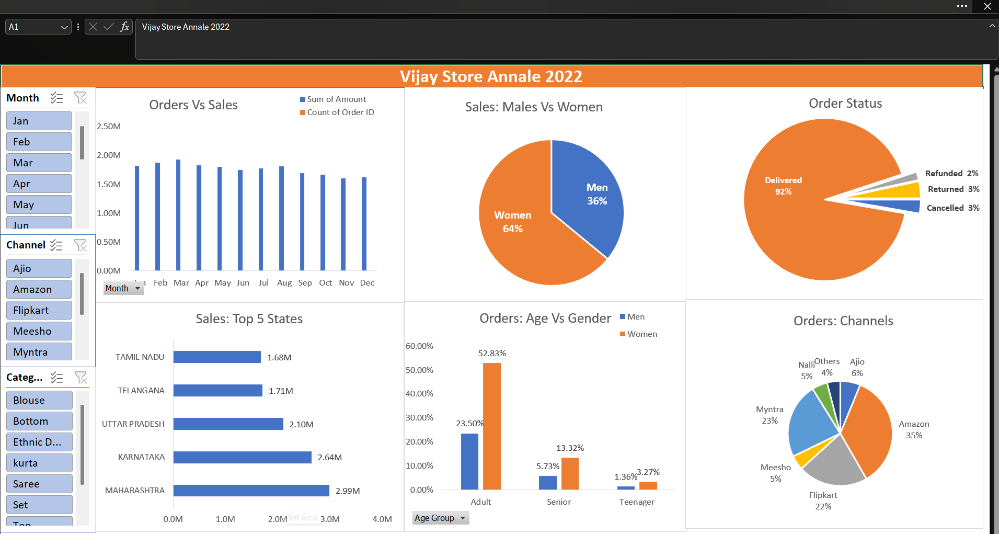
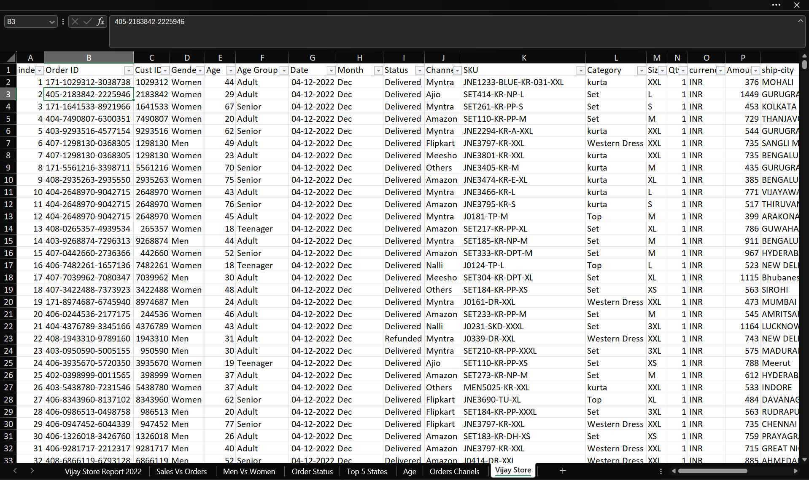

# 📊 Vijay Sales Analysis Dashboard

## 📌 Project Overview
This project is an interactive Excel dashboard created to analyze Vijay Sales retail data. It helps identify sales trends, customer behavior, order performance, and top-performing sales channels using Pivot Tables, Pivot Charts, KPI Cards, and Slicers.

---

## 🎯 Business Objective
The objective of this dashboard is to transform raw sales data into meaningful business insights that support data-driven decision-making.

---

## 🛠️ Tools Used
- Microsoft Excel
- Pivot Tables
- Pivot Charts
- Slicers
- KPI Cards
- Data Cleaning
- Data Visualization

---

## 📂 Files Included

- Vijay Store Data Analysis.xlsx (Dashboard)
- Vijay Store Raw Data.xlsx (Dataset)

---

## 📈 Dashboard Preview

---

## 📊 Key Insights

- Women contributed **64%** of total sales.
- Amazon generated the highest number of orders.
- Maharashtra recorded the highest sales.
- Adults placed the maximum number of orders.
- Around **92%** of all orders were successfully delivered.

---

## 📸 Additional Screenshots

### Sales vs Orders

### Age vs Gender

### Top 5 States

### Dataset Preview

---

## ⭐ Skills Demonstrated

- Data Cleaning
- Data Analysis
- Dashboard Design
- Business Intelligence
- Data Visualization
- Pivot Tables
- Excel Reporting

---

## 👨‍💻 Author

**Ayush Shedge**

Aspiring Data Analyst
